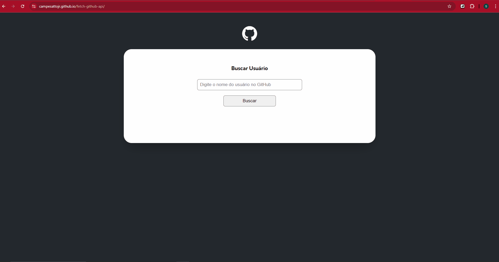
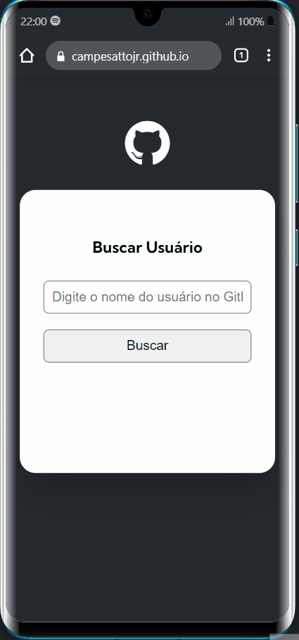

# Fetch-github-api

This project was developed during the DevQuest-DevEmDobro course. In this project, we were required to develop a page where, by entering the username, a GitHub API using fetch would retrieve user information and display it on the screen.

## Features
- By entering the username, the API fetches the name, bio, photo, and the last 10 repositories.
- The fetch operation should be triggered by clicking the button or pressing enter.
- If nothing is entered in the field, an alert should appear, instructing the user to fill in the field.
- If the user does not have a registered name, a message stating "no name registered" will appear. Similarly, if there is no bio registered, a message stating "no bio registered" will appear.
- Responsiveness.

## Technologies used
- HTML
- CSS
- JavaScript
- API GitHub

## Proposed challenge in the quest (adding new features)

Some updates were made to the project, adding new functionalities such as:
- In addition to displaying the user's image, full name, username, and bio (from the first stage), it now also shows:
  - Number of followers.
  - Number of people the user follows.
  - A list of the user's latest events, with a maximum limit of 10 events displayed on the screen.
     - If the events are "CreateEvent", a standard message should be displayed.
     - If the events are "PushEvent", the message of the last commit should be displayed.
  - The list of repositories should now display the number of forks, stars, views, and the programming language used in the repository.
 
## Final layout

## Mobile layout
